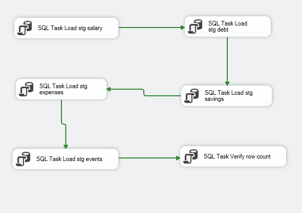
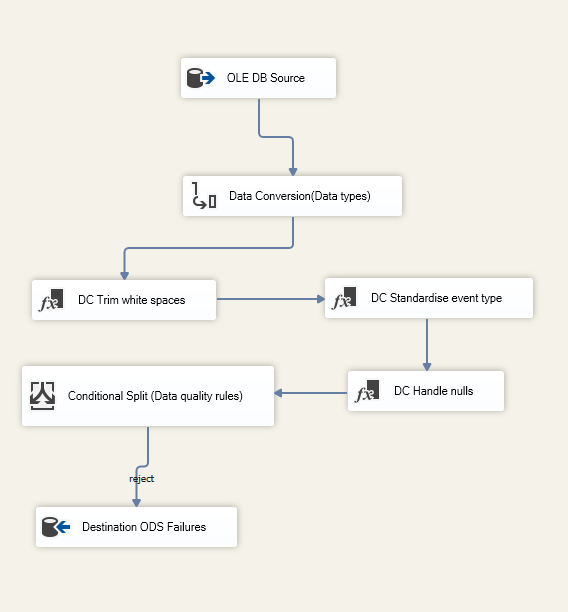
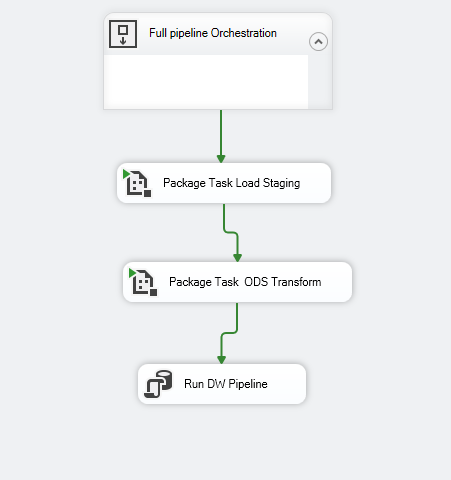
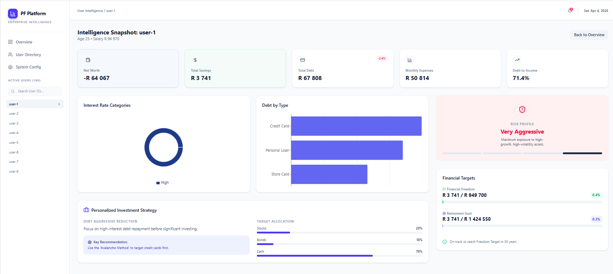

# Personal-Finance-Intelligence-Platform

# End to End Data Engineering Project
Stack:  SQL Server 2019+   |   SSIS (Visual Studio)   |   Power BI Desktop   |   Python 3   |   SQL Server Agent

# Overview

This project is an enterprise-grade financial intelligence platform designed to transform raw personal finance data into decision-ready insights.

Built on the Microsoft BI stack, the platform simulates how modern banks and fintechs:

Track customer financial behaviour over time
Maintain historical context for every financial decision
Generate personalised, data-driven financial guidance

Rather than simply reporting on transactions, this solution answers critical business questions:

How financially healthy is this user over time?
What changed in their financial profile, and when?
Are they on track for financial independence or retirement?
What actions should they take next?

# Business Value

This platform bridges the gap between data engineering and financial decision-making.

Enables:
Customer financial health scoring
Personalised financial recommendations
Time-aware analytics (historical state tracking)
Auditability of all financial decisions
Secure, user-level data access

# Designed for:
Retail banking analytics
Wealth management platforms
Financial advisory tools
Personal finance applications

# Architecture Overview

The solution is structured using a layered enterprise data architecture, ensuring scalability, traceability, and maintainability.

Layer	Schema	Business Purpose
Staging	stg	Raw ingestion with full traceability (batch_id, load_date, row hash)
ODS	ods	Trusted, validated, and enriched operational data
Warehouse	dw	Analytical layer with historical tracking and metrics
Control	ctrl	Pipeline orchestration, audit trails, and recovery
Security	sec	Data access enforcement at user level
Analytics	Power BI	Insight delivery and decision support

# Execution Flow
Build schemas and data model (SQL scripts)
Generate synthetic financial data
Execute SSIS pipelines
Load curated data into warehouse
Analyse via dashboard

# Key Features
1. Slowly Changing Dimensions (SCD Type 2)

The dim_user_financial_profile table maintains a complete history of user financial states.

Change detection via SHA2_256 hashing
Automatic versioning:
Old records expire (end_date, is_current = 0)
New records inserted on change
Enables historical analysis and time-aware insights

2. Incremental & Idempotent ETL
Uses watermarks from etl_pipeline_control to process only new data
Prevents duplication via UNIQUE constraints on event_id
Safe reprocessing:
Fact tables use controlled DELETE + INSERT strategy

3. Debt Classification Engine
Tier	Rule
Critical	≥ 15%
High	≥ 10%
Medium	≥ 5%
Low	< 5%

4. Financial Intelligence Engine

Key metrics derived within the warehouse:

Freedom Number = Monthly Expenses × 12 × 25
Retirement Number = Annual Expenses × 25
Net Worth = Savings − Debt
Freedom % = Savings ÷ Freedom Number × 100

5.Data Quality Framework
Validation rules applied during ODS load
Failed records routed to ods.dq_failures
Quality checks include:
Null user IDs
Negative values
Invalid interest rates
Orphaned records
Downstream processes controlled via dq_pass_flag

6.Security
Implemented using row-level security (RLS)
Enforced directly in SQL Server
Context-aware filtering via sp_set_session_context
Ensures users can only access their own financial data

# What This Project Demonstrates
Enterprise-grade ETL design
Event-driven data modelling
Historical data tracking (SCD Type 2)
Data quality and governance frameworks
Secure, scalable analytics architecture

Disclaimer: This project is for educational purposes only,it does not constitute financial advise
